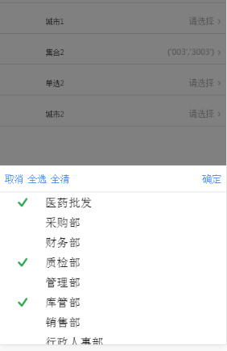
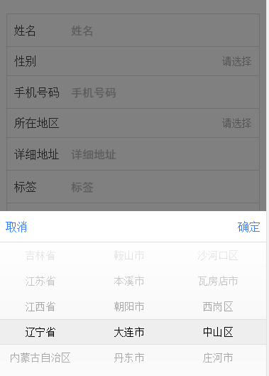
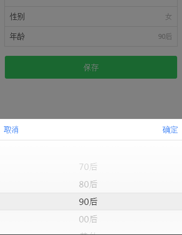

# ionic-setpicker 集合编辑器

支持多种编辑器

引入文件 在index.html文件中引入 ionic-setpicker.min.js
````html
<script src="lib/ionic-setpicker.min.js"></script>
````

在app.js里写入依赖
angular.module('myApp', ['ionic-setpicker'])

多选集合选择
````html
<ionic-set-picker set-model='setPickData' set-type="set"></ionic-set-picker>
````
城市选择
````html
<ionic-set-picker set-model='cityPickData' set-type="city"></ionic-set-picker>
````
单项选择
````html
<ionic-set-picker set-model='singlePickData' set-type="single"></ionic-set-picker>
````

````js
app.controller('setCtrl', function($scope) {
    $scope.setPickData = {
        title: "集合",
        Service: [
            {
                "key": "001",
                "text": "采购部"
            },
            {
                "key": "002",
                "text": "财务部"
            },
            {
                "key": "003",
                "text": "质检部"
            }]
    };
    $scope.cityPickData = {    
        title: '所在地区'        
    };    
    $scope.singlePickData = {    
        title: '年龄段',        
        Service: ['70后', '80后', '90后', '00后', '其他']        
    };    
})
````

###效果图:







